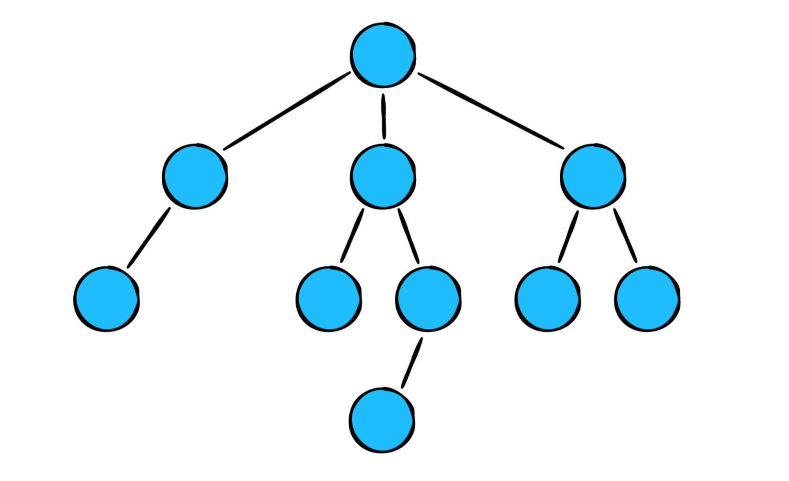
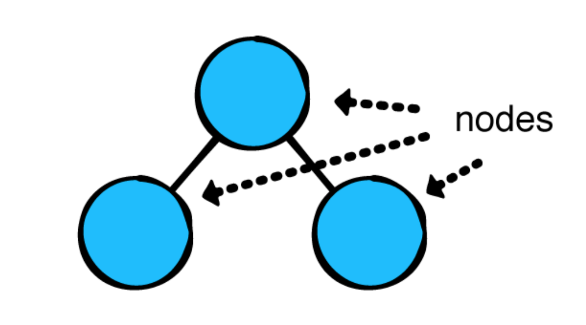
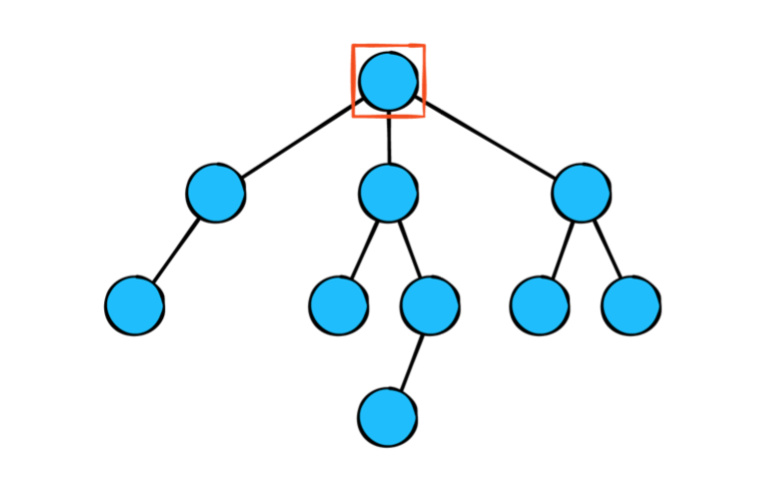
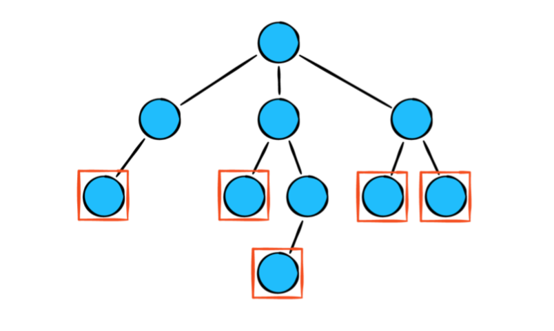

# Intro to Trees and the Binary Search Tree

## Goals
- Understand what's a Tree
- Components of a Tree
- Learn what a Binary Tree is
- Learn what a Binary Search Tree is and how to implement one.


## What's a Tree?



Trees play a major role in computer science. It is used to tackle many recurring challenges in software development, such as:
- Representing hierarchical relationships
- Managing sorted data
- Facilitating fast lookup operations
  
**Exercise**: Talk to your classmates about real world examples that could be represented by trees. Anything with branching possibilities? or hierarchy?

There are many types of trees each with their unique quirks and purposes.
These are some: 

* General Purpose Tree
* Binary Tree
  * Binary Search Tree
  * AVL tree
* N-ary Tree

From here, today we will focus on the Binary and Binary search trees.

## Components of a Tree

Before we dive into the binary trees. We must understand what every tree has in common. A tree is composed of a couple important pieces. They are:

1. Node
2. Root
3. Parent / Child
4. Leaf
5. Edges (lines connecting the nodes)

### Node 

As you can tell by now Nodes are the building blocks of basically all Abstract Data Structures (ADS). What makes them so useful:
- Abstraction to hold some sort of value
- Allows the ability to chain or link together other Nodes

That ability to chain and link together Nodes is what essentially makes an ADS. 



### Root

The first and topmost Node in a tree is called the Root. This Node has no parent or any previous Node linking to it.



### Parent / Child

Whenever a Node has a link to other Nodes it creates this Parent / Child relationship. The parent is the top Node that links to the new Nodes (child nodes).


### Leaf

A Leaf is any Node that does not contain any children Nodes. Essentially, they are the end of the line for the tree for that particular branch. 



## Binary Tree
In computer science, a binary tree is a tree data structure in which each node has at most two children, which are referred to as the left child and the right child.

<details>
<summary>Binary Tree Example</summary>


(source: wikipedia)

</details>


<details>
<summary>Not a Binary Tree Example</summary>


(source: wikipedia)

</details>

### Binary Tree implementation

#### Node

To implement a Binary Tree Node we need a way to store a value and somehow a reference or a pointer to a left and right children. So lets have a JavaScript object that will represent a Tree Node with such properties and create a Class to initialize such objects.

```javascript
class TreeNode {

  constructor(value) {
    this.value = value;
    this.left = null;
    this.right = null;
  }

}
```

**Exercise:** Compare this to a Linked List implementation. What differences and similarities do you find?

Now, just with that we can already build our first tree

```js
let a = new TreeNode("A");
let b = new TreeNode("B");
let c = new TreeNode("C");
let d = new TreeNode("D");
let e = new TreeNode("E");
let f = new TreeNode("F");
let g = new TreeNode("G");
let h = new TreeNode("H");
let i = new TreeNode("I");
let j = new TreeNode("J");
let k = new TreeNode("K");

a.left = b;
a.right = g;

b.left = c;
b.right = f;

c.left = d;
c.right = e;

g.left = h;
g.right = k;

h.left = i;
h.right = j;

// We could visualize the tree constructed as: 
//           (A)
//     (B)       (G)
//   (C) (F)  (H)   (K)
// (D)(E)   (I)(J)
```
**Exercises** Answer the following

* What node do you think is the root?
* How many nodes are in the tree?
* How many levels does the tree have?
* Having access only to the root, is there a way to get to the node with value `D`? If so how?
* Having access only to the root, is there a way to get to the node with value `J`? How?
* Similarly to what we did above to build a tree, write the code that will construct the following tree:
```
          (8)
     (4)       (9)
   (2) (5)  (7)   (10)
 (1)(3)   (6)(8)
```
  * Only through the root access(console.log) the node with value 9
  * Only through the root node access(console.log) the node with value 3
  * Only thorough the root change the value of the node with value 10 to 20. And console.log the before and after.

## Tree Traversal

* What if we wanted to print all the nodes in a tree? 
* What if we want to search for a given value in the tree? 
* In what order should we visit the nodes?

There are two approaches to traverse/search a tree:

* Depth First 
* Breadth First

As their name suggest one goes deeper first and the other goes wide first. You could think about it with the visualizations we have done as going vertical down(depth) and horizontal left to right(breath)

### Depth First Search/Traversal (DFS)

There are three recursive and one iterative algorithms to traverse a tree (visit all the nodes) in a depth first fashion. The algorithms are structurally the same, however they will differ in what order the values are 'visited'. Lets see the three algorithms that are recursive and have the same base case.

We'll use the tree that you built earlier:
```
          (A)
     (B)       (G)
  (C)  (F)  (H)   (K)
(D)(E)     (I)(J)
```

Lets say we want to print all the nodes in a tree. We can do so in the three following ways.

#### In-Order
Since our algorithms will be recursive we need to think of our base case. As always out base case needs to cover the scenario were the input is trivially small so that our program doesn't perform further calculation or crashes. 

```js
const inOrderPrint(root) {
  if (root === null) return;
  // ...
}
```

It's important to note that taking an entire tree as input is actually just a matter of taking in the root node. This is because the root node can access every other node through a path of edges.

Now the core of the algorithm is the following. Given the root of a tree, the steps for inOrderPrint are:

* print all nodes in the left subtree
* print root
* print all nodes in the right subtree

Taking this into code we have:
```js
const inOrderPrint(root) {
  if (!root) return;

  inOrderPrint(root.left)
  console.log(root.value)
  inOrderPrint(root.right)
}

```
Giver our tree, inOrderPrint would print the values in the order `D, C, E, B, F, A, I, H, J, G, K`.  In-Order has the pattern of left, self, right.

#### Pre-Order

Given the root of a tree, the steps for `preOrderPrint` are:
* print root
* print all nodes in the left subtree
* print all nodes in the right subtree

```js
const preOrderPrint = (root) => {
    if (!root) return;

    console.log(root.value);
    preOrderPrint(root.left);
    preOrderPrint(root.right);
}
```
Given our tree, `preOrderPrint` would print the values in the order: `A, B, C, D, E, F, G, H, I, J, K`. Pre-Order has the patten of self, left, right.

#### Post-Order

Given the root of a tree, the steps for `postOrderPrint` are:
* print all nodes in the left subtree
* print all nodes in the right subtree
* print root

```js 
const postOrderPrint = (root) => {
    if (!root) return;

    postOrderPrint(root.left);
    postOrderPrint(root.right);
    console.log(root.value);
}
```

Given our tree, `postOrderPrint` would print the values in the order: `D, E, C, F, B, I, J, H, K, G, A`.

#### Iteratively with a Stack
Iterative Depth First Traversal will require the use of a [Stack](https://github.com/joinpursuit/Pursuit-Core-DSA/tree/master/lessons/Stacks/web). Guess what? the recursive approaches above didn't need an explicit stack because the recursion is already using the internal **call stack**. For simplicity and illustration purposes let us use an array as a Stack.

```js
const iterativeDFS = (root) => {
  let stack = [root]
  
  while (stack.length) {      
    let currNode = stack.pop()

    console.log(currNode.value) // Visiting/accessing the node
    
    if (currNode.right) stack.push(currNode.right)
    if (currNode.left) stack.push(currNode.left)
  }
}

```
Given our tree, `iterativeDFS` would print the values in the order: `A, B, C, D, E, F, G, H, I, J, K`

### Breadth First Search/Traversal (BFS)
Also known as Level-Order traversal. Trees can be traversed in breadth-first fashion, where we visit every node on a level before going to a lower level. This search is referred to as breadth-first search (BFS), as the search tree is broadened as much as possible on each depth before going to the next depth.


Given the above tree if we traverse in level-order the order would be `F, B, G, A, D, I, C, E, H`.

### Implementation
Level order will require the use of a [Queue](https://github.com/joinpursuit/Pursuit-Core-DSA/tree/master/lessons/Queues/web) to aid us in visiting the nodes in a level-order fashion. For simplicity and illustration purposes let us use an array as a queue (note that this is less than optimal).

```js
const breadthFirst = (root) => {
    // Initialize the queue with the root node
    let queue = [ root ];

    // Continue running the algorithm while there are still nodes on the queue. As long a queue.length is truthy
    while (queue.length) {
        // Dequeue. Remove the front node in the queue. 
        let node = queue.shift();

        // The node we just removed is now "visited", so print it
        console.log(node.value);

        // Add/enqueue the left and right children to the back of the queue, if they exist.
        if (node.left) queue.push(node.left);
        if (node.right) queue.push(node.right);
    }
}
```

**Exercise**: 

* Write a function `treeIncludes` that searches a tree for a value and returns true or false depending on whether or not the value was found. Your function signature would be `treeIncludes(root, value)`. Use any of the traversal algorithms.
* Write a function `treeToArrayInOrder` that traverses a tree in-order a returns an array with its values.
* What is the time complexity of these algorithms?

### Binary Search Tree (BST)

A Binary Search Tree is a Binary Tree first and foremost. Its a tree that with one extra constraint acquires a huge benefit. A BST is a tree in which each node has at most two children, and additionally it satisfies the binary search property, which states that the value in each node must be greater than or equal to any value stored in the left sub-tree, and less than or equal to any value stored in the right sub-tree.

Another way of thinking about this is, a BST having two conditions:
- Every node's value in the `left` subtree must be less than that node's parent value
- Every node's value in the `right` subtree must be greater or equal to that node's parent value

Typically, BSTs are defined to have unique values and when people talk about trees they are, more commonly, talking about Binary Search Trees.

**Example**:


(source: wikipedia)

</details>


<details>
<summary>Not a BST Example</summary>


(source: wikipedia)

</details>

**Exercises**
* By hand, draw a Binary Search Tree for the following list of numbers `11, 25, 34, 42, 58, 60, 78, 86, 99, 100` 
* Similarly to what we did before to build a tree, code your tree by creating nodes and connecting them.

```js
const binarySearch = (root, value) => {
  // if the tree is empty, then the target val is not in the tree, so return false
  if (!root) return false;

  // otherwise the tree is not empty, so...
  if (value < root.value) {
      // if the target is less than the root,
      //  then search the left subtree
      return binarySearch(root.left, value);
  } else if (value > root.value){
      // if the target is greater than the root,
      //  then search the right subtree
      return binarySearch(root.right, value);
  } else {
      // otherwise, the target must be equal to the root
      // so return true since we found it!
      return true;
  }
}
```

### Resources
* [Tree Traversal](https://en.wikipedia.org/wiki/Tree_traversal)
* [Tree - Data Structure - Wikipedia](https://en.wikipedia.org/wiki/Tree_(data_structure))   
* [Trees - Ray Wenderlich](https://github.com/raywenderlich/swift-algorithm-club/tree/master/Tree) 
* [The iterative solution to inorder tree traversal, easily explained](https://medium.com/@amyhuajs/the-iterative-solution-to-inorder-tree-traversal-easily-explained-f25f09e5435b)


