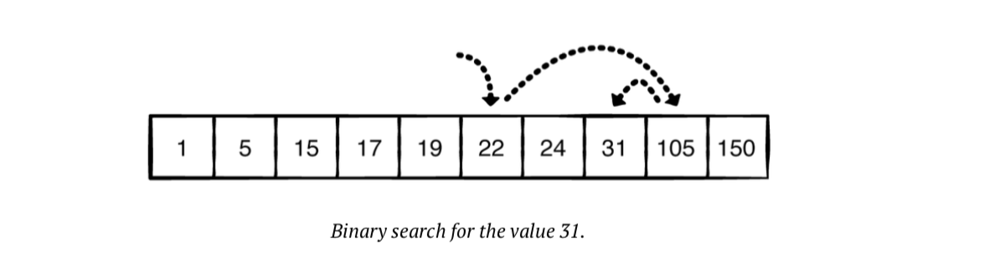

# Binary Search

## Goals
* Understand what is Binary Search
* Understand algorithm efficiency basics
* Write Binary Search in code

## Lesson

### What is Binary Search & why use it?

#### [Harvard CS50 Short Video Intro](https://youtu.be/jjqgP9dpD1k?t=1290)


Let's say you had a phone book and you wanted to find someone's name. The person is "John Smith".

What do we know?
1. The phone book is alphabetically ordered by first name
2. The name starts with the letter "J"

If we follow a Linear Search algorithm we would start at the beginning of the book from "A" and keep turning the pages until we reach "J". But more naturally you will probably start searching from the middle of the book because "J" is closer to the middle.

This is a very common searching problem and we can do better than Linear Search with O(n) run time. Binary search accomplishes the same task with O(log n).

### Binary Search Conditions

There are two conditions that need to be met before binary search may be used:

1. The collection must be able to access index  in constant time: O(1)
2. The collection must be sorted

### Binary Search Logic



#### Step 1: Find the middle index
The first step is to find the middle index of the collection

#### Step 2: Check the element at the middle index
Check the element stored at the middle index. If it matches the value you’re looking for, you return the index. Otherwise, you’ll continue to Step 3

#### Step 3: Recursively call Binary Search
Is the number you are looking for GREATER or LESS than the number you're looking for?

If the value you’re searching for is less than the middle value, you search the left subset. If it is greater than the middle value, you search the right subset.

Each step effectively removes half of the comparisons you would otherwise need to perform.

### Binary Search Implementation

#### Iterative Approach
```js
const binarySearch = (arr, value) => {
  // low and high keep track of which part of the list we are 
  // searching in
  let low = 0;
  let high = arr.length - 1

  // While we haven't narrowed it down to one element
  while (low <= high) {
    // Calculate the middle point and check if its the element
    // we are looking for
    let mid = Math.floor((low + high) / 2)
    let guess = arr[mid]

    if (guess === value) {  // Found it
      return mid
    } else if (guess > value ) { // Guess was too high
      high = mid - 1
    }  else {
      low = mid + 1 // Guess was too low
    }
  }
  return null // Element was not found.
}

let nums =  [1, 3, 5, 7, 9]
console.log(binarySearch(nums, 3))// -> 1
console.log(binarySearch(nums, -1)) // -> null
```

#### Recursive Approach

##### Passing low and high
```js
const binarySearchRec = (arr, target, low, high) => {
  // Base case
  if (low > high) return -1

  let mid = Math.floor((low + high) / 2);
  let guess = arr[mid]
  if (guess === target) {
    return mid
  } else if (guess > target) { // guess too high, lower high to mid
    return binarySearchRec(arr, target, low,  mid - 1);
  } else {
    return binarySearchRec(arr, target, mid + 1, high);
  }
}

let nums =  [1, 3, 5, 7, 9]
console.log(binarySearchRec(nums, 3, 0, nums.length - 1))// -> 1
console.log(binarySearchRec(nums, 4, 0, nums.length -1)) // -> -1
```

##### Actually splitting the array in halves

##### Step 1: Find the middle index

```javascript
// We know we want to pass in a sorted array
// and the value we want to search

const binarySearch = (arr, value) => {
  // Get Middle Index of the array
  const middle = Math.floor(arr.length/2);

}
```

First of all we create a function called 'binarySearch' and take in two parameters: arr and value. We will always need an array to check the middle of and compare it to the value. 

Finally we want to calculate the middle index for every time the array is passed.

##### Step 2: Check the element at the middle index

```javascript
const binarySearch = (arr, value) => {
  const middle = Math.floor(arr.length/2);

  // We want to compare the middle value with with the value we are looking for
  if (value === arr[middle]) {
    return middle;
  }
}
```

Our first comparison is to check if the value in the middle index is equal to what we are looking for. If it is, we then return the middle index.

##### Step 3: Check the element at the middle index

```javascript
const binarySearch = (arr, value) => {
  const middle = Math.floor(arr.length/2);

  // Divide the array into left and right halves
  const left = arr.slice(0, middle);
  const right = arr.slice(middle);

  if (value === arr[middle]) {
    return middle;
  }

  // If the value is smaller than middle value
  // Search Left
  else if (value < arr[mid]) {
    return binarySearch(left, value);
  }

  // If the value is greater than middle value
  // Search Right
  else {
    // We need to add middle to keep track
    // of how many elements offset from the left
    return middle + binarySearch(right, value);
  }
}
```

If our middle value does not match then we move on to checking the left or right side of the array. If we check the right side of the array, we need to keep track of the middle index offset to get the correct index value in the original array.

##### Step 4: Base Case or Fail Case

```javascript
const binarySearch = (arr, value) => {
  console.log("Searching: "+arr);
  // Base case
  // If the array ends up with no elements
  // Or if the last element is smaller than the value 
  if (arr.length <= 0 || value > arr[arr.length - 1]) {
    return -1;
  }

  const middle = Math.floor(arr.length/2);
  const left = arr.slice(0, middle);
  const right = arr.slice(middle);

  if (value === arr[middle]) {
    return middle;
  }
  else if (value < arr[middle]) {
    return binarySearch(left, value);
  }
  else {
    return middle + binarySearch(right, value);
  }
}
```

Finally, we need a fail case. We want to return -1 if the value does not exist in the array. We check if the array length ends up being zero or if the value is greater than the value of the last element in the array. 

## Exercises
* You have a sorted list of 128 names, and you’re searching through it using binary search. What’s the maximum number of steps it would take?
* What's the maximum number of steps if you double the size of the list?.
* Using binary search find the number of negative numbers in a sorted array. **Example** Input: `[10, 8, 7, 4, 3, 2, 1, 0, -1, -4, -5]`. Output: `3`
* In an array that contains booleans representing commits, if the commit is `true` the commit has a bug `false` means the commit does not have the bug. 
  * Find the index last good commit (the one right before the bug)
  * Or find the index of commit that introduced the bug
  ```js
  // Most recent commit is at index 0
  // Oldest commit is at index 9
  input = [true, true, true, true, true, true, true, false, false, false]
  output = 7 // last good commit is at index 7
  ```
  <details>
  <summary>Solution</summary> 

  ```js
  let commits = [true, true, true, true, true, true, true, false, false, false]

  const findBuggyCommit = (arr) => {
    let low = 0;
    let high = arr.length - 1;

    while (high > low) {
      let mid = Math.floor((low + high) / 2);
      let guess = arr[mid]

      if (guess === false) { 
        high = mid;
      } else {
        low = mid + 1;
      }
    }
    return high
  }

  console.log(findBuggyCommit(commits))
  ```
  </details>

## Resources
* [Binary Search - Khan Academy](https://www.khanacademy.org/computing/computer-science/algorithms/binary-search/a/binary-search)
* [Binary Search Visualizer - USFCA](https://www.cs.usfca.edu/~galles/visualization/Search.html)
* [Binary Search Video - CTCI Author](https://www.youtube.com/watch?v=P3YID7liBug)
