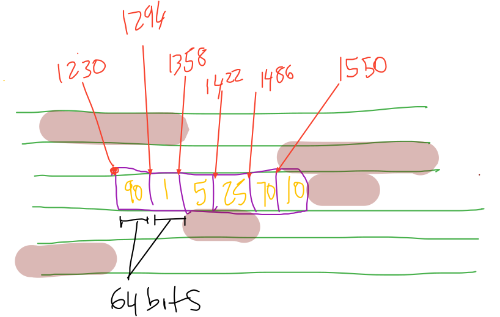
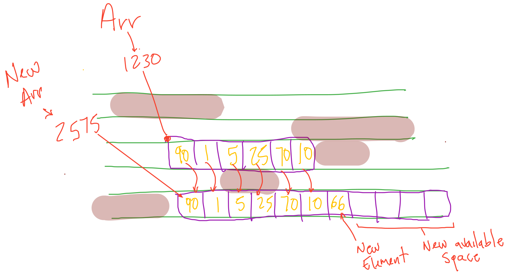

# Dynamic Array & Amortized Time

## Objectives
* Learn about and appreciate Dynamic Arrays
* Understand why appending elements to an array is considered a constant time operation `O(1)`.

## Array Basics
At the lowest level an array is just a contiguous allocation of space in computer memory.


In JavaScript, [Numbers](https://developer.mozilla.org/en-US/docs/Web/JavaScript/Reference/Global_Objects/Number) are stored using 64 bits. So our array in total will occupy 384 bits (64 x 6) of memory.

When you say:
```js
let arr = [90, 1, 5, 25, 70, 10]
```

`arr` is really a reference to beginning of our array, in other words `arr` is a pointer that is storing the memory address where our array starts. In this case let's say our array starts at memory address `1230`

## Constant time lookup (Pointer Arithmetic)
Let's learn how is it that the computer is able to access elements of an array by its index and in constant time. For the example in the image above we know the address the Array starts at (`1230`) and we know that each element occupies `64` bits.

* Array Start Address (`ASA`): `1230`
* Element Size: `64`
* Formula: `ASA + (Index * Element Size)`. To calculate the address/location of any element given the index.

| Index | Calculation       | Element Result Address/Location | Element |
| ----- | ----------------- | ------------------------------- | ------- |
| `0`   | `1230 + (0 * 64)` | `1230`                          | `90`    |
| `1`   | `1230 + (1 * 64)` | `1294`                          | `1`     |
| `2`   | `1230 + (2 * 64)` | `1358`                          | `5`     |
| `3`   | `1230 + (3 * 64)` | `1422`                          | `25`    |
| `4`   | `1230 + (4 * 64)` | `1486`                          | `70`    |
| `5`   | `1230 + (5 * 64)` | `1550`                          | `10`    |

Accessing elements in an array by index is a constant time operation because computers are really good at math and it takes them no time to calculate the location of an element in an array knowing the address at which the array start and the size of the elements. Its simple multiplication.



## Dynamic Array

### Concept
A dynamic Array is an Array that automatically resizes. In JavaScript Arrays are by default dynamic arrays, that's why you can keep pushing elements and the array will never complain saying that is full. Here we will learn how that is done "under the hood".

Lower level programing languages like C don't have dynamic arrays built-in, only fixed size arrays, if you wanted an array that grows as needed you need to implement it yourself.

#### The problem
Could we add one more element, say `66` to the array we visualize below? Yes? No? Why?. 


The answer is NO, we can't because the array is full and right next to the array some other program is using some memory. So what are our options?. 

1. Steal memory being used by other processes by overwriting it. So at the end of the array we could just steal another 64bits of space, add our element and f*ck whatever was there. In C you could actually do this but the other processes wouldn't like it and would likely crash at some point. This would be a very mean program and you would be a very mean developer. ☹️
2. Allocate a new contiguous space in memory that fits the current array plus the new element. 😐
3. Allocate a new contiguous space in memory that is double the capacity of the current array just in case we want to add more elements later on, so that we don't have to move the array each time we append. 😁

#### Solution
The solution is option **3** from above. Imagining (in JavaScript at least) that arrays would throw an error when trying to add an element when the array is full, we could write a function that catches the error, creates a new array **double** the size of our current array and copy the elements over to the new array, add the new element and return the new array.



Wouldn't it be nice if the array could do this by itself? We are still going to write a function or more specifically a **Method** to be part of our DynamicArray Class.

### Implementation
For this implementation we will pretend that arrays in JavaScript are not already dynamic and to do so we **will not** use any array methods. We will need to keep track of the size/length, create a new array as the current one becomes full and use loops for any operations we might need.

#### DynamicArray Class

```js
class DynamicArray {
  constructor(size) {
    this.internalArr = new Array(size); // Our internal array allocated with the initial size
    this.size = 0;                      // Current size of the array
    this.capacity = size;               // Total capacity of our DynamicArray
  }
}
```

#### push(elem) 
Push a new element to the array. ⚠️ Without using array methods

##### v1 
```js
  push(element) {
    if (this.size === this.capacity) { 
      throw new Error('Array is full') // For now, if we have reached the capacity of our array let's throw an error
    }

    this.internalArr[this.size] = element  // Use the size as the index to perform the adding
    this.size++ // Increase the size
  }
```

##### v2 
```js
  push(element) {
    if (this.size === this.capacity) { 
      this.resize() // If we have reached the capacity of our array resize our array
    }

    this.internalArr[this.size] = element  // Use the size as the index to perform the adding
    this.size++ // Increase the size
  }
```

#### resize()
```js
  resize() {
    let newCapacity = this.capacity * 2
    let newArray = new Array(newCapacity);  // Allocate new array with double capacity
    for (let i = 0; i < this.size; i++) {   
      newArray[i] = this.internalArr[i];    // Copy elements from internal array to new array
    }
    this.internalArr = newArray;            // Make the new array the new internalArr
    this.capacity = newCapacity             // Update capacity
  }
```
We use this method in v2 of `push()` so that if our array has reached capacity we resize it.


#### get(index)

Get an element by its index

```js
  get(index) {
    if (index > this.size) {
      throw new Error('Index out of bounds');
    }
    return this.internalArr[index];
  }
```

#### remove(index)

Remove the element at the specified index.

```js
 remove(index) {
    for (let i = index; i < this.size; i++) {
      if (this.internalArr[i + 1] !== undefined) {
        this.internalArr[i] = this.internalArr[i + 1];
      }
    }
    this.size = this.size - 1
  }
```

<details>
<summary> Complete DynamicArray Class</summary>

```js
class DynamicArray {
  constructor(size) {
    this.internalArr = new Array(size); // Our internal array allocated with the initial size
    this.size = 0;                      // Current size of the array
    this.capacity = size;               // Total capacity of our DynamicArray
  }

  push(element) {
    if (this.size === this.capacity) {
      this.resize()
    }

    this.internalArr[this.size] = element
    this.size++
  }

  resize() {
    let newCapacity = this.capacity * 2;
    let newArray = new Array(newCapacity)

    for (let i = 0; i < this.size; i++) {
      newArray[i] = this.internalArr[i]
    }

    this.internalArr = newArray;
    this.capacity = newCapacity
  }

  get(index) {
    if (index > this.size) {
      throw new Error('Index out of bounds');
    }
    return this.internalArr[index];
  }

  remove(index) {
    if (index >= this.size) throw new Error('Index out of bounds')

    let elem = this.internalArr[index]

    for (let i = index; i < this.size; i++) {
      if (this.internalArr[i + 1] !== undefined) {
        this.internalArr[i] = this.internalArr[i + 1];
      }
    }
    this.size = this.size - 1
    this.internalArr[this.size] = null
    return elem
  }
} 
// Example
let arr = new DynamicArray(2)

arr.push(1)
arr.push(2)
arr.push(3)
arr.remove(1)
console.log(arr.size)
console.log(arr.get(2))
arr.push(4)
console.log(arr.get(arr.size - 1))
```
</details>


## Amortized Time
* The time cost of every time we have to resize ("doubling") our array doubles each time.
* At the same time, the number of O(1) pushes you get until the next "doubling" also doubles.

These two things sort of "cancel out," and we can say each append has an average cost or **amortized** cost of O(1)

Example:
```js
let arr = new DynamicArray(1)

arr.push(1) // -> O(1)
arr.push(2) // -> resize O(n), new capacity = 2
arr.push(3) // -> resize O(n), new capacity = 4
arr.push(4) // -> O(1)
arr.push(5) // -> resize O(n), new capacity = 8
arr.push(6) // -> O(1)
arr.push(7) // -> O(1)
arr.push(8) // -> O(1)
arr.push(9) // -> resize O(n), new capacity = 16
arr.push(10) // -> O(1)
arr.push(11) // -> O(1)
arr.push(12) // -> O(1)
arr.push(13) // -> O(1)
arr.push(14) // -> O(1)
arr.push(15) // -> O(1)
arr.push(16) // -> O(1)
arr.push(17) // -> resize O(n), new capacity = 32
// Next resize won't happened until we have reached capacity 32 
// Which means the next 15 pushes will happen in constant time O(1)
console.log('size', arr.size) 
console.log('capacity', arr.capacity) 
```

Given this, we usually just say dynamic arrays have a time cost of O(1) for pushes or appends, even though strictly speaking that's only true for the average case or the amortized cost.

📑 For more details see CTCI page 43 or [Amortized Time](https://www.google.com/search?q=amortized+time)

## Exercises

Add the following methods to your DynamicArray and remember to **not** use any array method on `internalArr`

* `pop()`
* `slice()`
* `forEach()`
* `map()`
* Other built-in array methods of your choice.


## Resources
* [Dynamic Array - Interview Cake](https://www.interviewcake.com/concept/java/dynamic-array)
* [Dynamic Array - Wikipedia](https://en.wikipedia.org/wiki/Dynamic_array)
* [How do JavaScript arrays work under the hood?](https://ryanpeden.com/how-do-javascript-arrays-work-under-the-hood/)
* [Amortized Time of Algorithms](https://medium.com/@satorusasozaki/amortized-time-in-the-time-complexity-of-an-algorithm-6dd9a5d38045)
