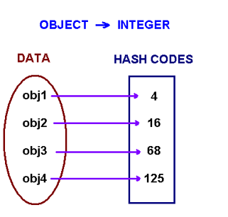
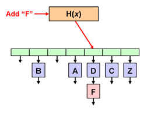

# Hash Tables

## Goals
- What's is a Hash Table?
- Hash Function
- Mapping & Collision
- Implementation


## Lesson 

## What's a Hash Table?

Hash Table is sometimes referred to as:
- Hash Map
- Dictionary
- Associative Array

It is one of the most useful and commonly utilized data structures. 

### Problem

Let's say you're a cashier and customers ask you what is the price of certain products. 

**Unordered Array**

Imagine our products were stored in an unordered/unsorted array.

```javascript
const products = [ { "orange": 1.25}, { "apple": 1.00}, { "strawberry": 2.10 }, { "banana": 1.00 }, { "blueberry": 1.96 }]
```

You would have to create a Linear Search algorithm which searches through this unsorted list and finds the item and finally returns you the value.

Our run time would be O(n).

**Ordered Array**

Now what if we ordered it?

```javascript
const products = [ { "apple": 1.00}, { "banana": 1.00 }, { "orange": 1.25}, { "blueberry": 1.96 }, { "strawberry": 2.10 }]
```

We can apply Binary Search and reduce the runtime to O(log n). Which is a HUGE increase in performance. But we can actually do better.

**Hash Table**

Imagine being able to ask a friend who has all the prices for every product memorized off the top of their head. 

```javascript
apple
=> 1.00

orange
=> 1.25

banana
=> 1.00

blueberry
=> 1.96

strawberry
=> 2.10

```

This friend would give you back a value for every key request that you ask. This runtime would actually be O(1).

That friend is your Hash Table. 

## Hash Functions

How is it a Hash Table gives back answers in O(1) time? It's because of the Hash Function. A hash function is a function where you put in a key value and you get back a number.



This function essentially runs in O(1) time complexity. So whenever you pass in a piece of data you always get back a number representing that data.

> Let's get rid of `"strawberry"` & `"blueberry"` for simplicity's sake. Imagine we are only dealing with 3 elements from now on.

Example:
```
"apple" => 4
"orange" => 2
"banana" => 7
```

Utilizing that number you essentially place it in an Array where the index is the number the Hash function returned. So essentially, you put your data into "buckets" or "slots" where you can easily access through some sort of Hash Function.

```javascript
const buckets = [];
buckets[4] = "apple";
buckets[2] = "orange";
buckets[7] = "banana";

console.log(buckets);
/* 
[ <2 empty items>,
  'orange',
  <1 empty item>,
  'apple',
  <2 empty items>,
  'banana' ]
*/
```

There are some requirements for a hash function:
- It needs to be consistent. For example, suppose you put in “apple” and get back “4”. Every time you put in “apple”, you should get “4” back. Without this, your hash table won’t work.
- It should map different words to different numbers. For example, a hash function is no good if it always returns “1” for any word you put in. In the best case, every different word should map to a different number.

### Simple Hash Function

For the sake of this lesson we will be using a very simple Hash function, just to give an idea. We will utilize the javascript function charCodeAt(_).

The charCodeAt(_) method returns an integer between 0 and 65535 representing the UTF-16 code unit at the given index. We are going to use this and sum up all the values returned by each letter in the string. The sum will be our Hash Value returned by the Hash Function.

```javascript 
function hash(key) {
  let sum = 0;
  for (let i = 0; i < key.length; i++) {
    sum += key.charCodeAt(i);
  }
  return sum;
}
```

Let's say we want to make a system that stores the following Name and Email Addresses:

| Name | Email |
| --- | --- |
| Sally | sally@email.com |
| Dean | dean@email.com |
| Dane | dane@email.com |

Let's run our Hash function on each of the names:

```javascript
hash("Sally"); // 517
hash("Dean");  // 376
hash("Dane");  // 376
```

Dean and Dane give have the same exact value. This is known as a "Collision Case". 

There are several ways to solve for Collision Cases but for the sake of this lesson, we will go with the simplest implementation using Nodes. This is called Chaining.

### Collision: Using Chaining



There will be cases when your Hash function returns the same value for multiple different cases. We can solve this problem using Chaining. 

Essentially imagine the array as the bucket holder. Each index in the array is a Linked List of Nodes "chained" together. 

So in our case above "Dean" and "Dane" would be in the index 376, chained together using a Linked List.

## Hash Table Implementation

### Container Classes

```javascript
class HashTable {
  constructor() {
    this.buckets = [];
  }
}

class Node {
  constructor(key, value, next = null) {
    this.key = key;
    this.value = value; 
    this.next = next;
  }
}
```

This is pretty straightforward. We want an array to keep track of all our buckets in our HashTable. 

We also need a Node class to hold the keys, values and pointer reference to the next Node in the chain.

### Insert 

```javascript
insert(key, value) {
  // Generate the bucket index using our Hash function
  var bucket = this.hash(key);
  // Create a new Node holding our key-value pair
  var newNode = new Node(key, value);
  
  // 1st Case - No Nodes Exist in that Bucket
  if(!this.buckets[bucket]) {
    this.buckets[bucket] = newNode;
  }
  // 2nd Case - Node Exists & Inserting key matches
  else if (this.buckets[bucket].key === key) {
    this.buckets[bucket].value = value;
  }
  // 3rd Case - Keys don't match traverse
  else {
    var currentNode = this.buckets[bucket];
    while(currentNode.next) {
      if (currentNode.next.key === key) {
        currentNode.next.value = value;
        return;
      }
      currentNode = currentNode.next;
    }
    currentNode.next = newNode;
  }
}
```

1. **1st Case:** If the array index does not contain any other node, that means this is the first one. You can insert the node.
2. **2nd Case:** A Node exists in the index. Checking if the Node's keys match. If they match, then you are just updating the value.
3. **3rd Case:** A chain of Nodes exists in the index. Traverse through the linked list, checking each time if the Keys match. If they match assign and update value. If none of them match, then attach the new Node at the end of the list.

### Get

```javascript
get(key) {
  var bucket = this.hash(key);
  
  // Nothing exists in that index
  if(!this.buckets[bucket]) {
    return null;
  }
  // Traverse through List searching for Key 
  else {
    var currentNode = this.buckets[bucket];
    if (currentNode.key === key) return currentNode.value;
    
    while(currentNode.next) {
      if (currentNode.next.key === key) return currentNode.next.value;
      currentNode = currentNode.next;
    }
    return null;
  }
}
```

Very similiar to the insert. We will look inside if something exists in the index. Then traverse through the Linked List to find the value we want. 

### Putting it all Together

```javascript
class Node {
  constructor(key, value, next = null) {
    this.key = key;
    this.value = value; 
    this.next = next;
  }
}

class HashTable {
  constructor() {
    this.buckets = [];
  }

  insert(key, value) {
    // Generate the bucket index using our Hash function
    var bucket = this.hash(key);
    // Create a new Node holding our key-value pair
    var newNode = new Node(key, value);
    
    // 1st Case - No Nodes Exist in that Bucket
    if(!this.buckets[bucket]) {
      this.buckets[bucket] = newNode;
    }
    // 2nd Case - Node Exists & Inserting key matches
    else if (this.buckets[bucket].key === key) {
      this.buckets[bucket].value = value;
    }
    // 3rd Case - Keys don't match traverse
    else {
      var currentNode = this.buckets[bucket];
      while(currentNode.next) {
        if (currentNode.next.key === key) {
          currentNode.next.value = value;
          return;
        }
        currentNode = currentNode.next;
      }
      currentNode.next = newNode;
    }
  }

  get(key) {
    var bucket = this.hash(key);
    
    // Nothing exists in that index
    if(!this.buckets[bucket]) {
      return null;
    }
    // Traverse through List searching for Key 
    else {
      var currentNode = this.buckets[bucket];
      if (currentNode.key === key) return currentNode.value;
      
      while(currentNode.next) {
        if (currentNode.next.key === key) return currentNode.next.value;
        currentNode = currentNode.next;
      }
      return null;
    }
  }

}
```

## Exercises

To this implementation of a `HashTable`

1. Add a method `has(key)` that returns a boolean indicating whether an element with the specified key exists or not.
2. Add a method `delete(key)` that removes and returns the element at the specified `key`.
3. Add a method `keys()` returns an array that contains the keys for each element in the `HashTable` object. 
4. Add a method `values()` returns an array that contains the values for each element in the `HashTable` object. 
5. Add a method `clear()` that removes all elements from a `HashTable` object.
6. Add a method `forEach(callback)` that executes a provided function once per each key/value pair in the `HashTable` object. The `callback` would receive the value of the given element as its argument. 

