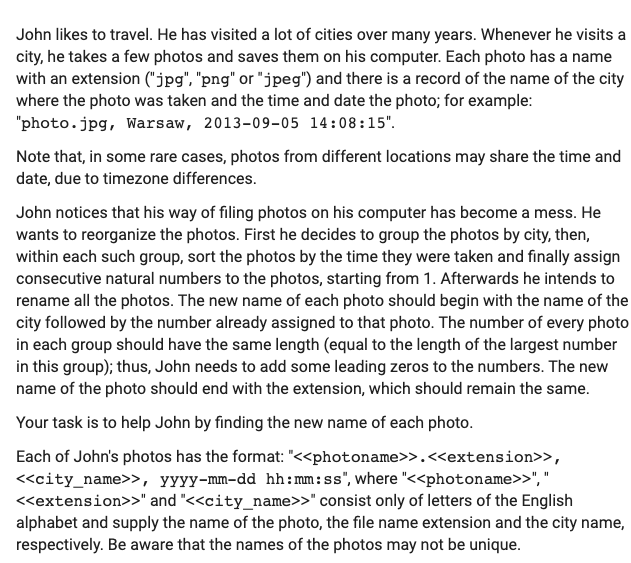
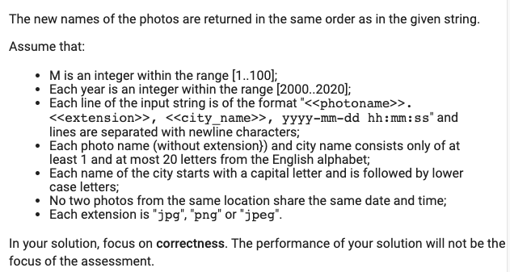

# Categorizing Photos

A non-strictly-DSA-focused problem.





Here's the sample input so you don't have to retype it:

```js
let input = `photo.jpg, Warsaw, 2013-09-05 14:08:15
john.png, London, 2015-06-20 15:13:22
myFriends.png, Warsaw, 2013-09-05 14:07:13
Eiffel.jpg, Paris, 2015-07-23 08:03:05
pisatower.jpg, Paris, 2015-07-22 23:59:59
BOB.jpg, London, 2015-08-05 00:02:03
notredame.png, Paris, 2015-09-01 12:00:00
me.jpg, Warsaw, 2013-09-06 15:40:22
a.png, Warsaw, 2016-02-13 13:33:50
b.png, Warsaw, 2016-01-02 15:12:22
c.png, Warsaw, 2016-01-02 14:34:30
d.png, Warsaw, 2016-01-02 15:15:01
e.png, Warsaw, 2016-01-02 09:49:09
f.png, Warsaw, 2016-01-02 10:55:32
g.png, Warsaw, 2016-02-29 22:13:11`

function solution(S) {
    // write your code here
}

console.log(solution(input))

```