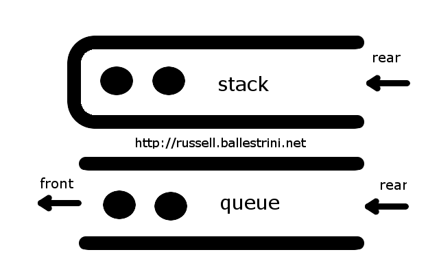

# Stacks and Queues



### Introduction
In most cases, the underlying data structure within stacks and queues will be an array. However, stacks and queues are more limited in their functionality and flexibility than arrays.

### First In First Out (FIFO)
E.g. you’re waiting on a line at the grocery store - if you’re the first person to get on the line, you’re the first to get off the line
### First In Last Out (FILO)
E.g. with a pile of plates - the first plate laid down is all the way at the bottom, the last plate added onto the pile is the first to get taken off

## Queues
A queue is a data structure that follows the FIFO rule where the first element added is the first to be removed.

### Queue Methods
* Enqueue function (adding the end of the queue)
* Dequeue function (removing the front of the queue)
Optional / Extra Methods
* Length / Size function (returns the number of elements)
* Front / Peek (returns the element at the front of the queue)
* isEmpty (returns true or false)

### Queue Example
```js
Queue.enqueue(1) // Queue = [1]
Queue.enqueue(2) // Queue = [1, 2]
Queue.peek() // returns 1
Queue.enqueue(3) // Queue = [1, 2, 3]
Queue.dequeue() // Queue = [2, 3]
Queue.length() // returns 2
Queue.dequeue() // Queue = [3]
Queue.isEmpty() // returns false
Queue.dequeue() // Queue = []
Queue.isEmpty() // returns true
```

## Stacks
A stack is a data structure that follows the FILO rule where the first element added is the last to be removed.

### Stack Methods
* Add function (adding element to the top of the stack)
* Remove function (removing element at the top of the stack)
Optional / Extra Methods
* Length / Size function (returns the number of elements)
* Top / Peek (returns the element at the top of the stack)
* isEmpty (returns true or false)

### Stack Example
```js
Stack.add(1) // Stack = [1]
Stack.add(2) // Stack = [1, 2]
Stack.top() // returns 1
Stack.add(3) // Stack = [1, 2, 3]
Stack.remove() // Stack = [1, 2]
Stack.length() // returns 2
Stack.remove() // Stack = [1]
Stack.isEmpty() // returns false
Stack.remove() // Stack = []
Stack.isEmpty() // returns true
```

## Stack and Queue Applications
* Uber Ride Assignment
* Customer Service Call Centers  
* Browser History (kind of)
* Any line you've ever waited on
* What else can you think of?

## Exercises
* Create a class or object to implement a stack.
* Create a class or object to implement a queue.
* Design a stack that also has a method that returns the smallest element in the stack.
* Design a queue that uses two stacks.
* Design a stack that uses two queues.

## Challenges
* Write a function that receives a stack and returns the stack sorted with the smallest items on top.
